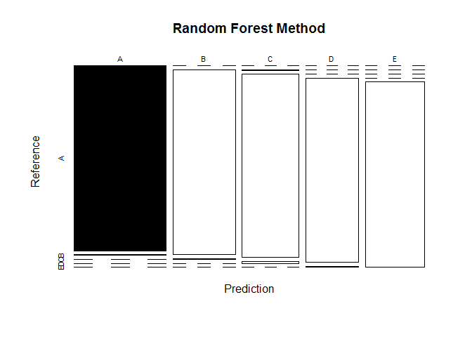

# PML_Project
DanH  
December 25, 2016  

###Overview

For this project the goal is to use data from accelerometers on the belt, forearm, arm, and dumbell of 6 participants to predict the manner in which they did the exercise. This is the "classe" variable in the training set. Then, the selected prediction model will be used to predict 20 different test cases.


###Load Data and packages


```r
# packages
library(tidyverse)
library(caret)
library(rpart)
library(rpart.plot)
library(rattle)
library(randomForest)
library(corrplot)
set.seed(12345)


# download the two datsets
train <-  read_csv("https://d396qusza40orc.cloudfront.net/predmachlearn/pml-training.csv")

test <- read_csv("https://d396qusza40orc.cloudfront.net/predmachlearn/pml-testing.csv")
```


###Data partitioning

Because we want to estimate the _out-of-sample error_, we split the full dataset(train) into a training set (trainset) and a validation set (testset)


```r
# split data to create trainset and testset
inTrain  <- createDataPartition(train$classe, p=0.7, list=FALSE) %>%
  as_data_frame(inTrain) %>% rename(X1 = Resample1)

trainset <- semi_join(train, inTrain)
testset <- anti_join(train, inTrain)
dim(trainset)
```

```
## [1] 13737   160
```

###Data cleaning

* First we remove variables with near Zero variance (NZV)
* We then delete predictors containing missing values
* Finally we remove useless variables


```r
NZV <- nearZeroVar(trainset)

trainset <-  trainset %>%
  select(-NZV) %>%
  select(which(colMeans(is.na(.)) == 0),
         -(1:5))

testset <- testset %>% 
  select(-NZV) %>%
  select(which(colMeans(is.na(.)) == 0),
         -(1:5))
```


We're now left with only 54 variables in each dataset

####Correlation

We can visualize correlation among predictors left in our dataset


```r
corMatrix <- cor(trainset[, -51])
corrplot(corMatrix, order = "FPC", method = "color", type = "lower", 
         tl.cex = 0.6, tl.col = rgb(0, 0, 0))
```


---

###Modeling

Here we try to fit some ML models to our data and see which one performs better. We will try:

* Decision Trees
* Random Forest
* Generalized Boosted Model

---

####Decision Trees


```r
# fitting the model
set.seed(12345)
DTree_ModFit <- rpart(classe ~ ., data=trainset, method="class")

# prediction 
DTree_predict <- predict(DTree_ModFit, newdata=testset, type="class")
DTree_ConfMat <- confusionMatrix(DTree_predict, testset$classe)
DTree_ConfMat
```

```
## Confusion Matrix and Statistics
## 
##           Reference
## Prediction    A    B    C    D    E
##          A 1464  203    5   72   14
##          B   43  695   38   68   83
##          C   76   87  818   72   87
##          D   38   78   94  662  112
##          E   53   76   71   90  786
## 
## Overall Statistics
##                                           
##                Accuracy : 0.7519          
##                  95% CI : (0.7407, 0.7629)
##     No Information Rate : 0.2845          
##     P-Value [Acc > NIR] : < 2.2e-16       
##                                           
##                   Kappa : 0.6859          
##  Mcnemar's Test P-Value : < 2.2e-16       
## 
## Statistics by Class:
## 
##                      Class: A Class: B Class: C Class: D Class: E
## Sensitivity            0.8746   0.6102   0.7973   0.6867   0.7264
## Specificity            0.9302   0.9511   0.9337   0.9346   0.9396
## Pos Pred Value         0.8328   0.7497   0.7175   0.6728   0.7305
## Neg Pred Value         0.9491   0.9104   0.9562   0.9384   0.9384
## Prevalence             0.2845   0.1935   0.1743   0.1638   0.1839
## Detection Rate         0.2488   0.1181   0.1390   0.1125   0.1336
## Detection Prevalence   0.2987   0.1575   0.1937   0.1672   0.1828
## Balanced Accuracy      0.9024   0.7807   0.8655   0.8106   0.8330
```

So, for the decision trees method we have **Accuracy: 0.7519**

---

####Random Forest

We now try a Random Forest model and see how it performs. We use a 3-fold cross-validation.


```r
set.seed(12345)
# Model fitting
RF_control <- trainControl(method="cv", 3)
RF_model <- train(classe ~ ., data=trainset, method="rf", trControl=RF_control, ntree=200)
RF_model$finalModel
```

```
## 
## Call:
##  randomForest(x = x, y = y, ntree = 200, mtry = param$mtry) 
##                Type of random forest: classification
##                      Number of trees: 200
## No. of variables tried at each split: 26
## 
##         OOB estimate of  error rate: 0.23%
## Confusion matrix:
##      A    B    C    D    E  class.error
## A 3903    3    0    0    0 0.0007680492
## B    6 2651    1    0    0 0.0026335591
## C    0    5 2390    1    0 0.0025041736
## D    0    0   10 2241    1 0.0048845471
## E    0    0    0    5 2520 0.0019801980
```

```r
# Prediction 
RF_predict <- predict(RF_model, newdata=testset)
RF_confMatrix <- confusionMatrix(RF_predict, testset$classe)
RF_confMatrix
```

```
## Confusion Matrix and Statistics
## 
##           Reference
## Prediction    A    B    C    D    E
##          A 1674    5    0    0    0
##          B    0 1132    4    0    0
##          C    0    2 1022   12    0
##          D    0    0    0  952    5
##          E    0    0    0    0 1077
## 
## Overall Statistics
##                                           
##                Accuracy : 0.9952          
##                  95% CI : (0.9931, 0.9968)
##     No Information Rate : 0.2845          
##     P-Value [Acc > NIR] : < 2.2e-16       
##                                           
##                   Kappa : 0.994           
##  Mcnemar's Test P-Value : NA              
## 
## Statistics by Class:
## 
##                      Class: A Class: B Class: C Class: D Class: E
## Sensitivity            1.0000   0.9939   0.9961   0.9876   0.9954
## Specificity            0.9988   0.9992   0.9971   0.9990   1.0000
## Pos Pred Value         0.9970   0.9965   0.9865   0.9948   1.0000
## Neg Pred Value         1.0000   0.9985   0.9992   0.9976   0.9990
## Prevalence             0.2845   0.1935   0.1743   0.1638   0.1839
## Detection Rate         0.2845   0.1924   0.1737   0.1618   0.1830
## Detection Prevalence   0.2853   0.1930   0.1760   0.1626   0.1830
## Balanced Accuracy      0.9994   0.9965   0.9966   0.9933   0.9977
```

So, for the Random Forest method we have **Accuracy: 0.995**

---

####Generalized Boosted Model

FInally we try a Generalized Boosted Model. 


```r
set.seed(12345)

# model fitting
GBM_control <- trainControl(method = "repeatedcv", number = 5, repeats = 1)
GBM_modFit  <- train(classe ~ ., data=trainset, method = "gbm",
                    trControl = GBM_control, verbose = FALSE)
GBM_modFit$finalModel
```

```
## A gradient boosted model with multinomial loss function.
## 150 iterations were performed.
## There were 50 predictors of which 39 had non-zero influence.
```

```r
# prediction 
predictGBM <- predict(GBM_modFit, newdata=testset)
confMatGBM <- confusionMatrix(predictGBM, testset$classe)
confMatGBM
```

```
## Confusion Matrix and Statistics
## 
##           Reference
## Prediction    A    B    C    D    E
##          A 1671   11    0    3    0
##          B    1 1111   19    2    3
##          C    0   13 1006   19    1
##          D    2    3    1  940   13
##          E    0    1    0    0 1065
## 
## Overall Statistics
##                                           
##                Accuracy : 0.9844          
##                  95% CI : (0.9809, 0.9874)
##     No Information Rate : 0.2845          
##     P-Value [Acc > NIR] : < 2.2e-16       
##                                           
##                   Kappa : 0.9802          
##  Mcnemar's Test P-Value : NA              
## 
## Statistics by Class:
## 
##                      Class: A Class: B Class: C Class: D Class: E
## Sensitivity            0.9982   0.9754   0.9805   0.9751   0.9843
## Specificity            0.9967   0.9947   0.9932   0.9961   0.9998
## Pos Pred Value         0.9917   0.9780   0.9682   0.9802   0.9991
## Neg Pred Value         0.9993   0.9941   0.9959   0.9951   0.9965
## Prevalence             0.2845   0.1935   0.1743   0.1638   0.1839
## Detection Rate         0.2839   0.1888   0.1709   0.1597   0.1810
## Detection Prevalence   0.2863   0.1930   0.1766   0.1630   0.1811
## Balanced Accuracy      0.9974   0.9851   0.9869   0.9856   0.9920
```

For the GB model we have **Accuracy: 0.984**

---

###Selected Model and test data

Based on previous results, the best model in terms of accuracy is Random Forest.
We use that model to predict the 20 quiz results (test dataset).


```r
QuizResults <- predict(RF_model, newdata=test)
QuizResults
```

```
##  [1] B A B A A E D B A A B C B A E E A B B B
## Levels: A B C D E
```

---

###Appendix


```r
# Decision tree method
plot(DTree_ConfMat$table, col = DTree_ConfMat$byClass, 
     main = "Decision Tree Method")
```

<!-- -->

```r
# Random Forest
plot(RF_confMatrix$table, col = RF_confMatrix$byClass,
              main = "Random Forest Method")
```

<!-- -->

```r
# Generalized Boosted Model
plot(confMatGBM$table, col = confMatGBM$byClass,
     main = "Generalized Boosted Model")
```

<!-- -->

